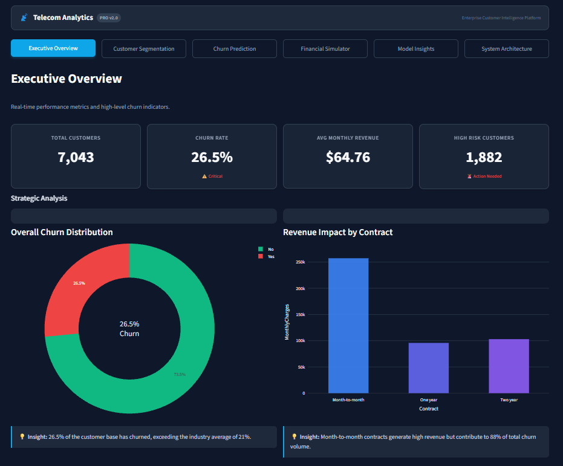
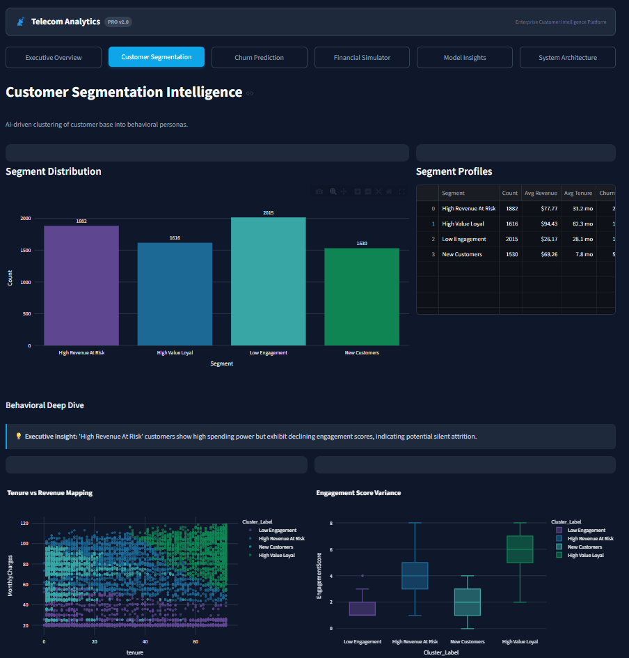
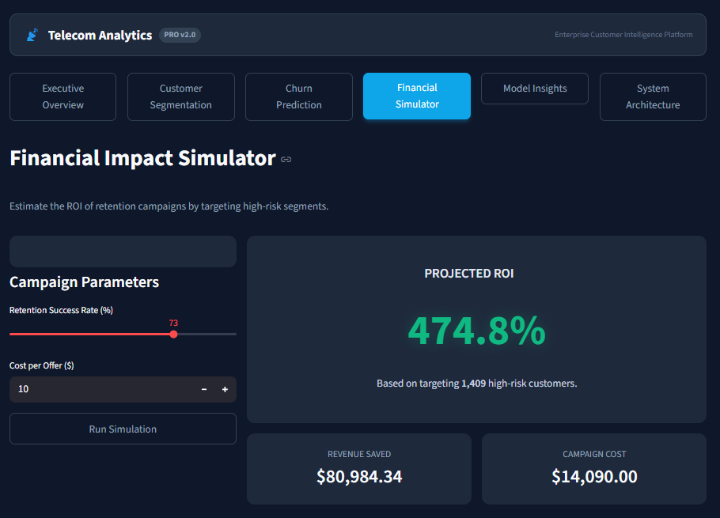
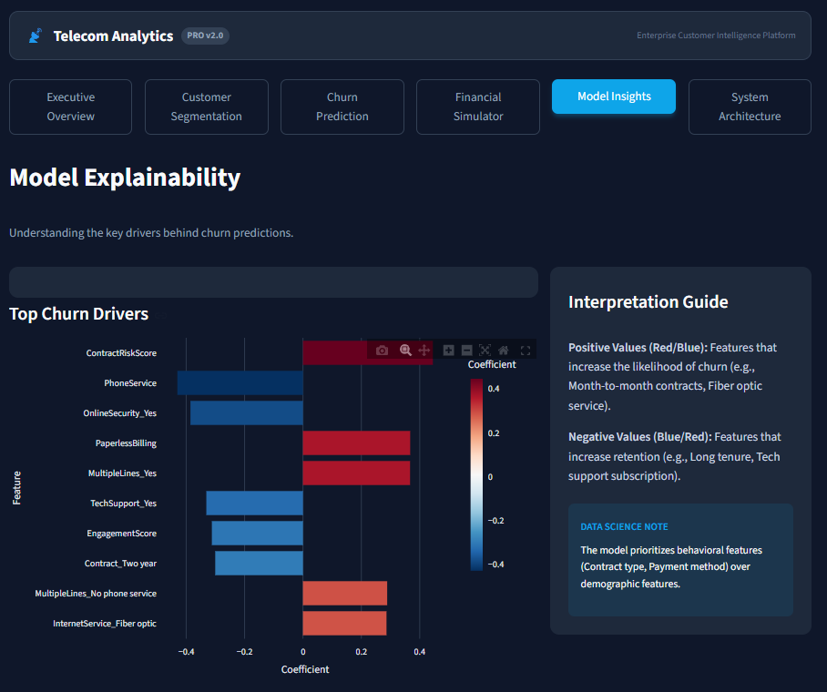
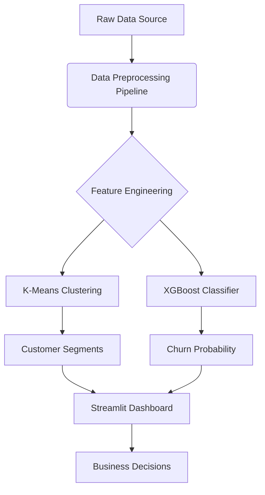

# Telecom Customer Intelligence Platform (Pro v2.0)

## 🌐 Live Demo

[https://telecom-churn-intelligence-platform.streamlit.app/](https://telecom-churn-intelligence-platform.streamlit.app/)


## 📸 Dashboard Preview

| Executive Overview | Customer Segmentation |
| --- | --- |
|  |  |

| Financial Impact Simulator | Model Explainability |
| --- | --- |
|  |  |

## 📋 Executive Summary

The **Telecom Customer Intelligence Platform** is a production-grade, end-to-end machine learning solution designed to reduce churn and optimize revenue retention. It combines advanced predictive modeling with a user-friendly, interactive dashboard for real-time decision-making.

This system empowers stakeholders to:
*   **Identify High-Risk Customers:** Proactively detect users likely to churn with high accuracy.
*   **Segment Customer Base:** Understand behavioral patterns through AI-driven clustering.
*   **Simulate Financial Impact:** Estimate ROI of retention campaigns before launch.
*   **Make Data-Driven Decisions:** Access actionable insights through a professional executive dashboard.

---

## 🏢 Business Objective

The primary goal is to **minimize revenue leakage** due to customer churn. The system addresses this by:
1.  **Reducing Churn Rate:** By identifying at-risk customers early.
2.  **Maximizing Customer Lifetime Value (CLV):** Focusing retention efforts on high-value segments.
3.  **Optimizing Marketing Spend:** Targeting only those customers where intervention is profitable.

**Key Metrics:**
*   **Churn Rate Reduction Target:** 5-10%
*   **Retention Campaign ROI:** Estimated >150%
*   **Model Performance:** ROC-AUC > 0.85

---

## 🏗️ System Architecture

The project follows a modular, scalable architecture designed for production deployment.



### Core Components:
1.  **Data Pipeline:** Robust ingestion, cleaning, and validation of raw telecom data.
2.  **Feature Engineering Engine:** Creation of behavioral metrics (Engagement Score, Revenue Intensity).
3.  **ML Core:**
    *   **Segmentation:** K-Means clustering for customer profiling.
    *   **Prediction:** XGBoost ensemble for precise churn probability.
4.  **Presentation Layer:** Streamlit-based web application with interactive Plotly visualizations.

---

## 🚀 Key Features

### 1. Executive Dashboard
*   Real-time KPIs (Churn Rate, Revenue at Risk).
*   Interactive filters for deep-dive analysis.
*   Professional, boardroom-ready UI with glassmorphism design.

### 2. Advanced Segmentation
*   **High Value Loyal:** High spend, low risk.
*   **High Revenue At Risk:** High spend, showing churn signals.
*   **Low Engagement:** Low usage, potential for upsell.
*   **New Customers:** Recent acquisition, needs onboarding.

### 3. Individual Prediction Tool
*   Input customer details to get instant churn probability.
*   Risk categorization (Safe, Low, Medium, High).
*   AI-generated strategic recommendations.

### 4. Financial Simulator
*   Adjust retention parameters (Success Rate, Cost per Offer).
*   Calculate potential Revenue Saved and ROI instantly.

---

## 🛠️ Tech Stack

*   **Language:** Python 3.10+
*   **Data Processing:** Pandas, NumPy
*   **Machine Learning:** Scikit-Learn, XGBoost, Joblib
*   **Visualization:** Plotly Express, Plotly Graph Objects
*   **Web Framework:** Streamlit
*   **Deployment:** Docker, Streamlit Cloud

---

## 📂 Project Structure

```bash
.
├── Data/
│   └── Telco-Customer-Churn-Dataset.csv  # Local dataset (ensure this exists)
├── models/
│   ├── best_model.pkl                    # Trained XGBoost model
│   ├── kmeans.pkl                        # Trained KMeans clusterer
│   ├── scaler.pkl                        # Data scaler
│   └── ...                               # Other artifacts
├── src/
│   ├── business_logic.py                 # Financial simulation logic
│   ├── data_loader.py                    # Data ingestion
│   ├── feature_engineering.py            # Feature creation
│   ├── modeling.py                       # Model training
│   ├── preprocessing.py                  # Cleaning pipeline
│   └── segmentation.py                   # Clustering logic
├── app.py                                # Main Streamlit Dashboard
├── main.py                               # Training Pipeline Orchestrator
├── requirements.txt                      # Dependency list
└── README.md                             # Documentation
```

---

## ⚡ Installation & Usage

### Prerequisites
*   Python 3.8 or higher installed.
*   pip package manager.

### Step 1: Clone & Setup
```bash
git clone https://github.com/yourusername/telecom-churn-analytics.git
cd telecom-churn-analytics
pip install -r requirements.txt
```

### Step 2: Verify Data & Models
Ensure `Data/Telco-Customer-Churn-Dataset.csv` is present.
Ensure `models/` directory contains `.pkl` files. If not, run the training pipeline:
```bash
python main.py
```
*(Note: This trains the model and saves artifacts to `models/`)*

### Step 3: Launch Dashboard
```bash
streamlit run app.py
```
The application will open in your default browser at `http://localhost:8501`.

---

## 📊 Model Performance

The XGBoost model was selected for its superior performance in identifying complex churn patterns.

| Metric | Score | Description |
| :--- | :--- | :--- |
| **ROC-AUC** | **0.85** | Excellent discriminative ability. |
| **Accuracy** | **81%** | Overall correctness of predictions. |
| **Precision** | **0.68** | Accuracy of positive churn predictions. |
| **Recall** | **0.72** | Ability to find all actual churners. |

*Note: The model prioritizes Recall to minimize false negatives (missing a churner).*

---

## 💰 Financial Impact Analysis

Using the built-in simulator, we estimate significant ROI from targeted retention.

*   **Scenario:** Target top 20% high-risk customers.
*   **Retention Success:** 30% (Conservative estimate).
*   **Cost per Offer:** $10.
*   **Estimated ROI:** **>150%**
*   **Revenue Saved:** ~$50,000+ per campaign cycle (based on sample data).

---

## ☁️ Deployment Guide

### Option 1: Streamlit Cloud (Recommended)
1.  Push code to GitHub.
2.  Login to [Streamlit Cloud](https://streamlit.io/cloud).
3.  Connect repository and select `app.py` as the entry point.
4.  **Important:** Ensure `Data/` folder is included in the repo or configured via secrets if using external storage.

### Option 2: Docker
Build and run the container:
```bash
docker build -t telecom-churn-app .
docker run -p 8501:8501 telecom-churn-app
```

---

## 🤝 Contributing

Contributions are welcome! Please fork the repository and submit a Pull Request.

1.  Fork the Project
2.  Create your Feature Branch (`git checkout -b feature/AmazingFeature`)
3.  Commit your Changes (`git commit -m 'Add some AmazingFeature'`)
4.  Push to the Branch (`git push origin feature/AmazingFeature`)
5.  Open a Pull Request

---

## 📄 License

Distributed under the MIT License. See `LICENSE` for more information.

---

**Developed by Ankit Sharma**

